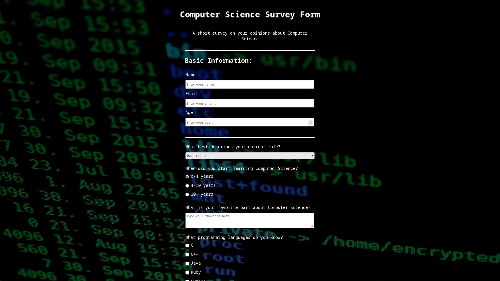
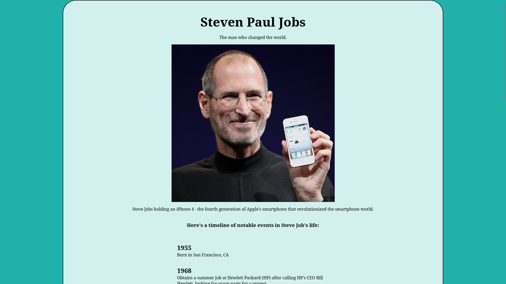
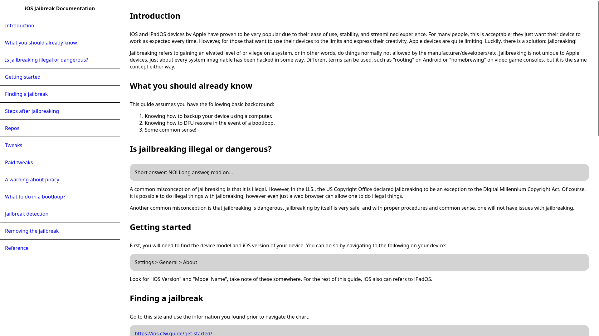
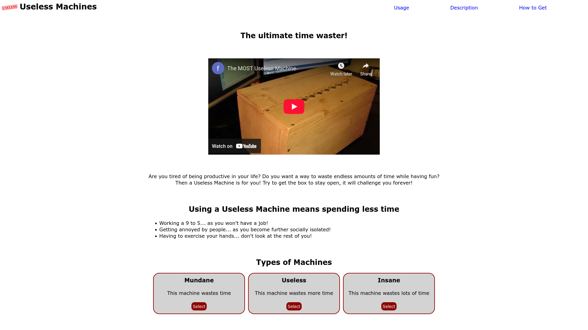
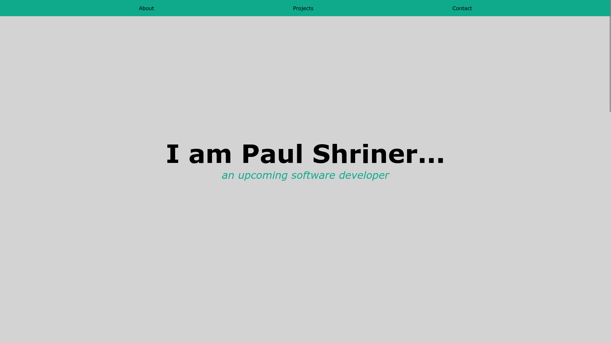

# freeCodeCamp Responsive Web Design Certificate

These are the projects I did in the completion of this certificate.

[Here](https://www.freecodecamp.org/certification/fcc30aca8b2-d2c4-4009-a397-2e6d1ecbde3b/responsive-web-design) is my certificate on freeCodeCamp.

## Projects

### Survey Form

A survey asking questions about Computer Science.

### Tribute Page

A tribute to Apple co-founder Steve Jobs with a timeline of notable events.

### Technical Documentation Page

A page with information about iOS jailbreaking.

### Project Landing Page

A page about the Useless Machine, the most useful machine in the world...

### Personal Portfolio Page

A basic personal web page with links to projects and GitHub/freeCodeCamp profile links.

## Skills
- HTML
- CSS
- Responsive Web Design

## Development Tools

- [VS Code](https://code.visualstudio.com/) - Development environment
  - [Live Server](https://marketplace.visualstudio.com/items?itemName=ritwickdey.LiveServer) - VS Code extension that provides live reload capabilities for web pages
- [Git](https://git-scm.com/)/[GitHub](https://github.com/) - Version control

## Running the Projects

Demos for the projects are accessible from the certificate link. At the bottom of the page, click on "View" > "View Project" to view the respective project.

It is also possible to clone the repo to run the projects locally.
