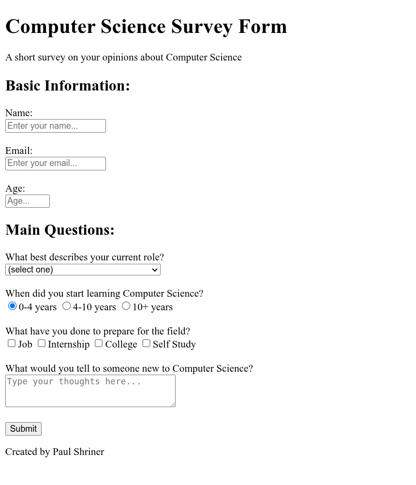

# freeCodeCamp Responsive Web Design Certificate

These are the projects I did in the completion of this certificate.

## Projects

### Survey Form

A survey asking questions about Computer Science.

## Skills

- HTML

## Development Tools

- [VS Code](https://code.visualstudio.com/) - Development environment
  - [Live Server](https://marketplace.visualstudio.com/items?itemName=ritwickdey.LiveServer) - VS Code extension that provides live reload capabilities for web pages
- [Git](https://git-scm.com/)/[GitHub](https://github.com/) - Version control

## Running the Projects

Coming soon
